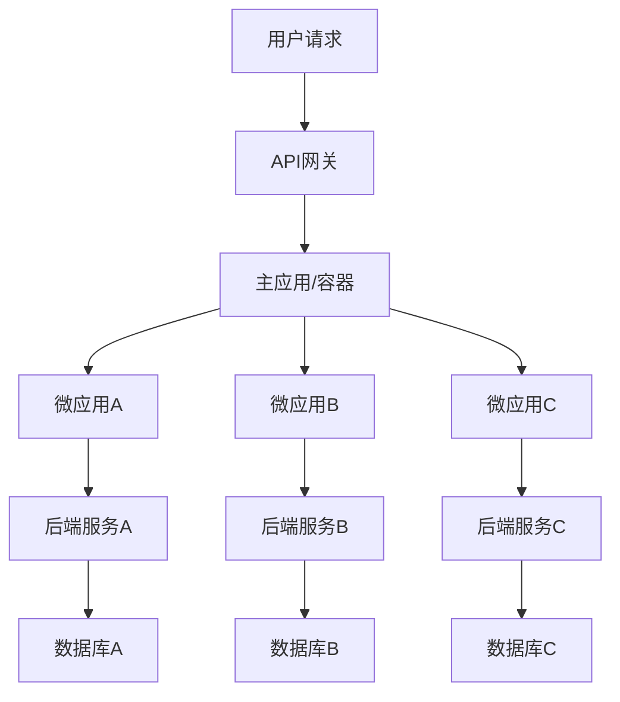

# 企业级微前端架构

## 企业级微前端架构概述

在大型企业级应用中，传统的单体前端架构面临着团队协作困难、技术栈统一性差、部署复杂度高等挑战。企业级微前端架构应运而生，它不仅解决了这些问题，还为企业级应用提供了更好的可扩展性、可维护性和团队自治能力。

### 企业级微前端的核心价值

1. **团队自治**：不同业务团队可以独立开发、测试、部署自己的功能模块
2. **技术多样性**：各微应用可以选择最适合的技术栈，不受主应用限制
3. **风险隔离**：单个微应用的问题不会影响整个系统的稳定性
4. **渐进式迁移**：可以从现有系统逐步迁移到微前端架构
5. **独立扩展**：根据业务需求独立扩展特定功能模块

### 企业级微前端的挑战

1. **复杂性管理**：系统整体复杂度增加，需要更好的架构设计
2. **数据一致性**：跨微应用的数据共享和状态管理
3. **样式冲突**：不同微应用间的CSS样式隔离
4. **性能优化**：多个应用间的资源加载和性能协调
5. **安全管控**：微应用间的权限控制和安全隔离

## 企业级微前端架构设计

### 整体架构模式



### 核心组件设计

#### 1. 主应用容器

```typescript
// 主应用核心容器
class MainApplication {
  private microApps: Map<string, MicroApp>;
  private router: Router;
  private stateManager: GlobalStateManager;
  private eventBus: EventBus;

  constructor() {
    this.microApps = new Map();
    this.router = new Router();
    this.stateManager = new GlobalStateManager();
    this.eventBus = new EventBus();
    this.init();
  }

  private async init() {
    // 初始化路由
    this.setupRoutes();
    
    // 注册微应用
    await this.registerMicroApps();
    
    // 启动应用
    this.start();
  }

  private setupRoutes() {
    // 动态路由配置
    const routes = [
      {
        path: '/dashboard',
        microApp: 'dashboard',
        loadStrategy: 'eager'
      },
      {
        path: '/user',
        microApp: 'user-management',
        loadStrategy: 'lazy'
      },
      {
        path: '/order',
        microApp: 'order-system',
        loadStrategy: 'lazy'
      }
    ];

    routes.forEach(route => {
      this.router.addRoute(route.path, async () => {
        const app = this.microApps.get(route.microApp);
        if (app) {
          await app.mount({
            container: '#micro-app-container',
            globalState: this.stateManager.getState(),
            eventBus: this.eventBus
          });
        }
      });
    });
  }

  private async registerMicroApps() {
    // 从配置中心获取微应用配置
    const appConfigs = await this.fetchAppConfigs();
    
    for (const config of appConfigs) {
      const microApp = new MicroApp(config);
      this.microApps.set(config.name, microApp);
      
      // 预加载策略
      if (config.loadStrategy === 'eager') {
        await microApp.preload();
      }
    }
  }
}
```

#### 2. 微应用生命周期管理

```typescript
// 微应用生命周期接口
interface MicroAppLifecycle {
  bootstrap(): Promise<void>;
  mount(props: MountProps): Promise<void>;
  unmount(): Promise<void>;
  update?(props: UpdateProps): Promise<void>;
}

// 微应用实现
class MicroApp implements MicroAppLifecycle {
  private config: MicroAppConfig;
  private instance: any;
  private status: 'NOT_LOADED' | 'LOADING' | 'LOADED' | 'MOUNTED' | 'UNMOUNTED';

  constructor(config: MicroAppConfig) {
    this.config = config;
    this.status = 'NOT_LOADED';
  }

  async bootstrap(): Promise<void> {
    if (this.status !== 'NOT_LOADED') return;
    
    this.status = 'LOADING';
    try {
      // 动态加载微应用代码
      this.instance = await this.loadApp();
      this.status = 'LOADED';
    } catch (error) {
      this.status = 'NOT_LOADED';
      throw error;
    }
  }

  async mount(props: MountProps): Promise<void> {
    if (this.status === 'NOT_LOADED') {
      await this.bootstrap();
    }

    if (this.status === 'LOADED') {
      await this.instance.mount(props);
      this.status = 'MOUNTED';
    }
  }

  async unmount(): Promise<void> {
    if (this.status === 'MOUNTED' && this.instance) {
      await this.instance.unmount();
      this.status = 'UNMOUNTED';
    }
  }

  async update(props: UpdateProps): Promise<void> {
    if (this.status === 'MOUNTED' && this.instance?.update) {
      await this.instance.update(props);
    }
  }

  async preload(): Promise<void> {
    if (this.status === 'NOT_LOADED') {
      // 预加载关键资源
      await this.loadCriticalResources();
    }
  }

  private async loadApp(): Promise<any> {
    // 根据配置加载微应用
    switch (this.config.type) {
      case 'module-federation':
        return await this.loadModuleFederationApp();
      case 'iframe':
        return await this.loadIframeApp();
      case 'web-component':
        return await this.loadWebComponentApp();
      default:
        throw new Error(`Unsupported micro app type: ${this.config.type}`);
    }
  }
}
```

## 企业级通信机制

### 全局状态管理

```typescript
// 企业级全局状态管理器
class EnterpriseStateManager {
  private state: Record<string, any>;
  private listeners: Map<string, Set<Function>>;
  private microAppStates: Map<string, Record<string, any>>;
  private persistenceStrategy: PersistenceStrategy;

  constructor(options: StateManagerOptions) {
    this.state = {};
    this.listeners = new Map();
    this.microAppStates = new Map();
    this.persistenceStrategy = options.persistenceStrategy || 'localStorage';
    this.init();
  }

  private init() {
    // 从持久化存储恢复状态
    this.restoreState();
    
    // 监听状态变化
    window.addEventListener('storage', this.handleStorageChange.bind(this));
  }

  setState(key: string, value: any, options?: SetStateOptions) {
    const oldValue = this.state[key];
    this.state[key] = value;
    
    // 通知监听器
    this.notifyListeners(key, value, oldValue);
    
    // 持久化存储
    if (options?.persist) {
      this.persistState(key, value);
    }
    
    // 跨微应用同步
    if (options?.broadcast) {
      this.broadcastStateChange(key, value);
    }
  }

  getState(key: string): any {
    return this.state[key];
  }

  subscribe(key: string, listener: Function) {
    if (!this.listeners.has(key)) {
      this.listeners.set(key, new Set());
    }
    this.listeners.get(key)!.add(listener);
    
    // 返回取消订阅函数
    return () => {
      const listeners = this.listeners.get(key);
      if (listeners) {
        listeners.delete(listener);
      }
    };
  }

  private notifyListeners(key: string, newValue: any, oldValue: any) {
    const listeners = this.listeners.get(key);
    if (listeners) {
      listeners.forEach(listener => {
        try {
          listener(newValue, oldValue);
        } catch (error) {
          console.error('State listener error:', error);
        }
      });
    }
  }

  // 微应用专属状态管理
  setMicroAppState(appName: string, key: string, value: any) {
    if (!this.microAppStates.has(appName)) {
      this.microAppStates.set(appName, {});
    }
    const appState = this.microAppStates.get(appName)!;
    appState[key] = value;
  }

  getMicroAppState(appName: string, key: string): any {
    const appState = this.microAppStates.get(appName);
    return appState ? appState[key] : undefined;
  }
}
```

### 事件总线系统

```typescript
// 企业级事件总线
class EnterpriseEventBus {
  private events: Map<string, Set<EventHandler>>;
  private middleware: EventMiddleware[];
  private securityManager: SecurityManager;

  constructor(options: EventBusOptions) {
    this.events = new Map();
    this.middleware = [];
    this.securityManager = options.securityManager;
  }

  // 发布事件
  emit(eventName: string, data: any, options?: EmitOptions) {
    // 安全检查
    if (!this.securityManager.isAllowed(eventName, 'emit')) {
      throw new Error(`Event ${eventName} is not allowed to emit`);
    }

    // 执行中间件
    let processedData = data;
    for (const middleware of this.middleware) {
      processedData = middleware.process(eventName, processedData);
    }

    // 发布事件
    const handlers = this.events.get(eventName);
    if (handlers) {
      handlers.forEach(handler => {
        try {
          handler(processedData, options);
        } catch (error) {
          console.error(`Error in event handler for ${eventName}:`, error);
        }
      });
    }

    // 跨微应用广播
    if (options?.broadcast) {
      this.broadcastEvent(eventName, processedData);
    }
  }

  // 订阅事件
  on(eventName: string, handler: EventHandler, options?: SubscribeOptions) {
    if (!this.events.has(eventName)) {
      this.events.set(eventName, new Set());
    }
    
    // 安全检查
    if (!this.securityManager.isAllowed(eventName, 'subscribe')) {
      throw new Error(`Event ${eventName} is not allowed to subscribe`);
    }

    this.events.get(eventName)!.add(handler);

    // 返回取消订阅函数
    return () => {
      const handlers = this.events.get(eventName);
      if (handlers) {
        handlers.delete(handler);
      }
    };
  }

  // 一次性订阅
  once(eventName: string, handler: EventHandler) {
    const onceHandler = (data: any) => {
      handler(data);
      this.off(eventName, onceHandler);
    };
    
    return this.on(eventName, onceHandler);
  }

  // 取消订阅
  off(eventName: string, handler: EventHandler) {
    const handlers = this.events.get(eventName);
    if (handlers) {
      handlers.delete(handler);
    }
  }

  // 添加中间件
  use(middleware: EventMiddleware) {
    this.middleware.push(middleware);
  }

  // 事件审计
  audit(eventName: string): EventAuditInfo {
    return {
      eventName,
      subscriberCount: this.events.get(eventName)?.size || 0,
      lastEmitTime: this.getLastEmitTime(eventName),
      securityLevel: this.securityManager.getEventLevel(eventName)
    };
  }
}
```

## 企业级样式隔离方案

### CSS 命名空间方案

```scss
// 主应用样式命名空间
.main-app {
  // 全局样式
  --primary-color: #1890ff;
  --secondary-color: #52c41a;
  
  // 组件样式
  .header {
    background: var(--primary-color);
    padding: 16px;
  }
  
  .content {
    min-height: calc(100vh - 64px);
  }
}

// 微应用样式隔离
.dashboard-app {
  // 微应用专属变量
  --dashboard-primary: #722ed1;
  --dashboard-secondary: #fa8c16;
  
  .widget {
    border: 1px solid var(--dashboard-primary);
    border-radius: 4px;
    padding: 12px;
  }
  
  .chart {
    width: 100%;
    height: 300px;
  }
}
```

### Shadow DOM 隔离方案

```typescript
// Shadow DOM 样式隔离组件
class IsolatedMicroApp extends HTMLElement {
  private shadow: ShadowRoot;
  private appInstance: any;

  constructor() {
    super();
    this.shadow = this.attachShadow({ mode: 'closed' });
  }

  async connectedCallback() {
    // 加载微应用样式
    await this.loadStyles();
    
    // 挂载微应用
    await this.mountApp();
  }

  private async loadStyles() {
    const style = document.createElement('style');
    style.textContent = await this.fetchAppStyles();
    this.shadow.appendChild(style);
  }

  private async mountApp() {
    const container = document.createElement('div');
    container.id = 'app-container';
    this.shadow.appendChild(container);
    
    // 挂载 React/Vue 应用
    this.appInstance = await this.initializeApp(container);
  }

  private async fetchAppStyles(): Promise<string> {
    const response = await fetch(this.getAttribute('stylesheet')!);
    return response.text();
  }

  private async initializeApp(container: HTMLElement) {
    const appName = this.getAttribute('app-name')!;
    const appModule = await import(/* webpackIgnore: true */ appName);
    return appModule.default.mount(container);
  }

  disconnectedCallback() {
    if (this.appInstance && this.appInstance.unmount) {
      this.appInstance.unmount();
    }
  }
}

customElements.define('isolated-micro-app', IsolatedMicroApp);
```

## 企业级性能优化

### 智能预加载策略

```typescript
// 企业级预加载管理器
class EnterprisePreloader {
  private preloadQueue: PreloadTask[];
  private resourceCache: Map<string, any>;
  private networkManager: NetworkManager;
  private priorityManager: PriorityManager;

  constructor(options: PreloaderOptions) {
    this.preloadQueue = [];
    this.resourceCache = new Map();
    this.networkManager = options.networkManager;
    this.priorityManager = new PriorityManager();
  }

  // 智能预加载
  async smartPreload(userContext: UserContext) {
    // 基于用户行为预测预加载
    const predictedResources = await this.predictResources(userContext);
    
    // 按优先级排序
    const sortedResources = this.priorityManager.sortByPriority(predictedResources);
    
    // 批量预加载
    await this.batchPreload(sortedResources);
  }

  // 关键资源预加载
  async preloadCriticalResources(route: string) {
    const criticalResources = this.getCriticalResources(route);
    
    // 并行预加载
    await Promise.all(
      criticalResources.map(resource => this.preloadResource(resource))
    );
  }

  // 预加载资源
  private async preloadResource(resource: PreloadResource) {
    const cacheKey = this.getCacheKey(resource);
    
    // 检查缓存
    if (this.resourceCache.has(cacheKey)) {
      return this.resourceCache.get(cacheKey);
    }
    
    // 网络预加载
    const data = await this.networkManager.preload(resource.url, {
      priority: resource.priority,
      credentials: resource.credentials
    });
    
    // 缓存结果
    this.resourceCache.set(cacheKey, data);
    
    return data;
  }

  // 基于机器学习的资源预测
  private async predictResources(userContext: UserContext): Promise<PreloadResource[]> {
    // 调用预测服务
    const predictions = await fetch('/api/predict-next-resources', {
      method: 'POST',
      headers: { 'Content-Type': 'application/json' },
      body: JSON.stringify(userContext)
    }).then(res => res.json());
    
    return predictions.map((prediction: any) => ({
      url: prediction.resource,
      priority: prediction.confidence,
      type: prediction.type
    }));
  }
}
```

### 性能监控与分析

```typescript
// 企业级性能监控系统
class EnterprisePerformanceMonitor {
  private metrics: PerformanceMetrics;
  private reporters: PerformanceReporter[];
  private thresholds: PerformanceThresholds;

  constructor(options: MonitorOptions) {
    this.metrics = new PerformanceMetrics();
    this.reporters = options.reporters || [];
    this.thresholds = options.thresholds || DEFAULT_THRESHOLDS;
    this.init();
  }

  private init() {
    // 监控核心指标
    this.observeCoreVitals();
    
    // 监控微应用性能
    this.observeMicroAppPerformance();
    
    // 定期上报
    setInterval(() => this.reportMetrics(), 30000);
  }

  private observeCoreVitals() {
    // LCP 监控
    new PerformanceObserver((list) => {
      list.getEntries().forEach(entry => {
        if (entry.entryType === 'largest-contentful-paint') {
          this.metrics.set('LCP', entry.startTime);
          this.checkThreshold('LCP', entry.startTime);
        }
      });
    }).observe({ entryTypes: ['largest-contentful-paint'] });

    // FID 监控
    new PerformanceObserver((list) => {
      list.getEntries().forEach(entry => {
        if (entry.entryType === 'first-input') {
          this.metrics.set('FID', entry.processingStart - entry.startTime);
          this.checkThreshold('FID', entry.processingStart - entry.startTime);
        }
      });
    }).observe({ entryTypes: ['first-input'] });
  }

  private observeMicroAppPerformance() {
    // 监听微应用加载时间
    window.addEventListener('micro-app-loaded', (event: CustomEvent) => {
      const { appName, loadTime } = event.detail;
      this.metrics.set(`micro-app-${appName}-load-time`, loadTime);
      
      // 性能阈值检查
      this.checkThreshold(`micro-app-${appName}-load-time`, loadTime);
    });
  }

  private checkThreshold(metricName: string, value: number) {
    const threshold = this.thresholds[metricName];
    if (threshold && value > threshold) {
      // 触发告警
      this.triggerAlert(metricName, value, threshold);
    }
  }

  private triggerAlert(metricName: string, value: number, threshold: number) {
    const alert = {
      metric: metricName,
      value,
      threshold,
      timestamp: Date.now(),
      severity: this.calculateSeverity(value, threshold)
    };

    // 发送到告警系统
    this.reporters.forEach(reporter => {
      reporter.reportAlert(alert);
    });
  }

  private calculateSeverity(value: number, threshold: number): 'low' | 'medium' | 'high' {
    const ratio = value / threshold;
    if (ratio > 2) return 'high';
    if (ratio > 1.5) return 'medium';
    return 'low';
  }

  private reportMetrics() {
    const report = {
      timestamp: Date.now(),
      metrics: this.metrics.getAll(),
      environment: this.getEnvironmentInfo()
    };

    this.reporters.forEach(reporter => {
      reporter.reportMetrics(report);
    });
  }
}
```

## 企业级安全管控

### 微应用权限控制

```typescript
// 企业级权限管理系统
class EnterprisePermissionManager {
  private permissions: Map<string, PermissionRule[]>;
  private roleHierarchy: Map<string, string[]>;
  private auditLogger: AuditLogger;

  constructor(options: PermissionOptions) {
    this.permissions = new Map();
    this.roleHierarchy = new Map();
    this.auditLogger = options.auditLogger;
    this.init();
  }

  // 检查微应用访问权限
  async checkMicroAppAccess(userId: string, appName: string): Promise<boolean> {
    const userRoles = await this.getUserRoles(userId);
    const appPermissions = this.permissions.get(appName) || [];
    
    // 检查角色权限
    const hasPermission = userRoles.some(role => 
      this.checkRolePermission(role, appPermissions)
    );
    
    // 记录审计日志
    this.auditLogger.log({
      action: 'micro-app-access',
      userId,
      resource: appName,
      granted: hasPermission,
      timestamp: Date.now()
    });
    
    return hasPermission;
  }

  // 检查API调用权限
  async checkApiPermission(userId: string, apiPath: string, method: string): Promise<boolean> {
    const userRoles = await this.getUserRoles(userId);
    const apiPermissions = this.getApiPermissions(apiPath, method);
    
    const hasPermission = userRoles.some(role => 
      this.checkRolePermission(role, apiPermissions)
    );
    
    return hasPermission;
  }

  // 动态权限更新
  async updatePermissions(updates: PermissionUpdate[]) {
    for (const update of updates) {
      switch (update.type) {
        case 'add':
          this.addPermission(update.resource, update.rule);
          break;
        case 'remove':
          this.removePermission(update.resource, update.ruleId);
          break;
        case 'update':
          this.updatePermission(update.resource, update.ruleId, update.rule);
          break;
      }
    }
    
    // 通知权限变更
    this.notifyPermissionChange(updates);
  }

  private async getUserRoles(userId: string): Promise<string[]> {
    // 从用户服务获取角色信息
    const response = await fetch(`/api/users/${userId}/roles`);
    const data = await response.json();
    return data.roles;
  }

  private checkRolePermission(role: string, permissions: PermissionRule[]): boolean {
    return permissions.some(permission => {
      // 直接角色匹配
      if (permission.role === role) return true;
      
      // 角色继承检查
      const ancestors = this.getRoleAncestors(role);
      return ancestors.includes(permission.role);
    });
  }

  private getRoleAncestors(role: string): string[] {
    const ancestors: string[] = [];
    const directAncestors = this.roleHierarchy.get(role) || [];
    
    for (const ancestor of directAncestors) {
      ancestors.push(ancestor);
      ancestors.push(...this.getRoleAncestors(ancestor));
    }
    
    return ancestors;
  }
}
```

### 内容安全策略

```typescript
// 企业级内容安全策略管理
class EnterpriseCSPManager {
  private policies: Map<string, CSPConfig>;
  private enforcementMode: 'report-only' | 'enforce';

  constructor(options: CSPManagerOptions) {
    this.policies = new Map();
    this.enforcementMode = options.enforcementMode || 'report-only';
    this.init();
  }

  private init() {
    // 设置默认CSP策略
    this.setDefaultPolicy();
    
    // 监听CSP违规报告
    this.setupViolationReporting();
  }

  // 为微应用设置CSP策略
  setMicroAppPolicy(appName: string, policy: CSPConfig) {
    this.policies.set(appName, policy);
    
    // 动态更新策略
    this.updatePolicyHeaders(appName, policy);
  }

  // 生成CSP头部
  generateCSPHeader(policy: CSPConfig): string {
    const directives: string[] = [];
    
    Object.entries(policy).forEach(([directive, sources]) => {
      if (sources.length > 0) {
        directives.push(`${directive} ${sources.join(' ')}`);
      }
    });
    
    return directives.join('; ');
  }

  // 动态更新策略头部
  private updatePolicyHeaders(appName: string, policy: CSPConfig) {
    const cspHeader = this.generateCSPHeader(policy);
    
    // 通过Service Worker或服务器端更新
    if ('serviceWorker' in navigator) {
      navigator.serviceWorker.controller?.postMessage({
        type: 'UPDATE_CSP',
        appName,
        cspHeader
      });
    }
  }

  // 设置违规报告处理
  private setupViolationReporting() {
    // 监听CSP违规事件
    document.addEventListener('securitypolicyviolation', (event) => {
      this.handleViolation(event);
    });
  }

  private handleViolation(event: SecurityPolicyViolationEvent) {
    const violation = {
      documentURI: event.documentURI,
      violatedDirective: event.violatedDirective,
      effectiveDirective: event.effectiveDirective,
      originalPolicy: event.originalPolicy,
      blockedURI: event.blockedURI,
      sourceFile: event.sourceFile,
      lineNumber: event.lineNumber,
      columnNumber: event.columnNumber,
      timestamp: Date.now()
    };

    // 发送违规报告
    this.reportViolation(violation);
  }

  private async reportViolation(violation: CSPViolation) {
    try {
      await fetch('/api/csp-violations', {
        method: 'POST',
        headers: { 'Content-Type': 'application/json' },
        body: JSON.stringify(violation)
      });
    } catch (error) {
      console.error('Failed to report CSP violation:', error);
    }
  }
}
```

## 总结

企业级微前端架构是一个复杂的系统工程，需要在技术架构、团队协作、安全管控、性能优化等多个维度进行综合考虑。通过合理的架构设计和完善的治理体系，微前端架构能够为企业级应用提供更好的可扩展性和可维护性，支持业务的快速发展和团队的高效协作。

关键成功因素包括：
1. **明确的架构设计**：清晰的职责划分和接口定义
2. **完善的治理体系**：标准化的开发流程和质量保障
3. **强大的基础设施**：可靠的部署和监控平台
4. **持续的优化改进**：基于数据驱动的持续优化

随着技术的不断发展，企业级微前端架构将继续演进，为前端工程化带来更多的可能性和价值。